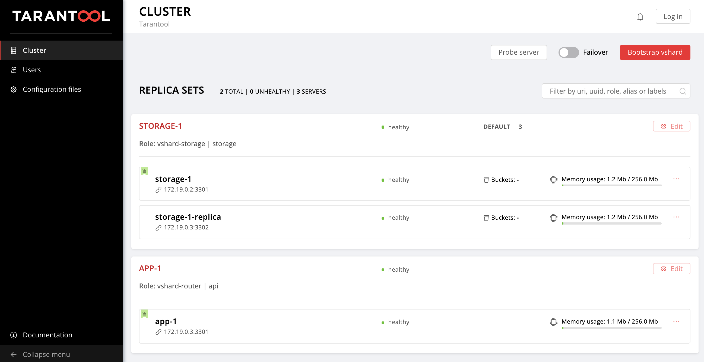

# Deploy Tarantool Cartridge application

Example of [Tarantool Cartridge](https://galaxy.ansible.com/tarantool/cartridge) role using.

Full documentation you can find [here](https://github.com/tarantool/ansible-cartridge/tree/1.0.1#ansible-role-tarantool-cartridge).


This example is used in the tutorial dedicated to the Tarantool Cartridge Ansible role ([Russian](https://habr.com/ru/company/mailru/blog/478710/) and [English](https://habr.com/ru/company/mailru/blog/480468/)).

## Requirements

* Ansible 2.8.4 or higher.
* Vagrant

## Run example

First, start two vagrant virtual machines:

```bash
$ vagrant up
```

Install Tarantool Cartridge role:

```bash
$ ansible-galaxy install tarantool.cartridge,1.0.1
```

Then, deploy Tarantool Cartridge application on this machines and set up cluster topology:

```bash
$ ansible-playbook -i hosts.yml playbook.yml
```

Wait for playbook to be completed.

Then, go to the http://localhost:8181/admin/cluster/dashboard and enjoy!



## Add one more replicaset

Run playbook with updated inventory:

```bash
$ ansible-playbook -i hosts.updated.yml playbook.yml
```

Again, go to the http://localhost:8181/admin/cluster/dashboard.


## Stop virtual machines

Don't forget to stop virtual machines:

```bash
$ vagrant halt
```
